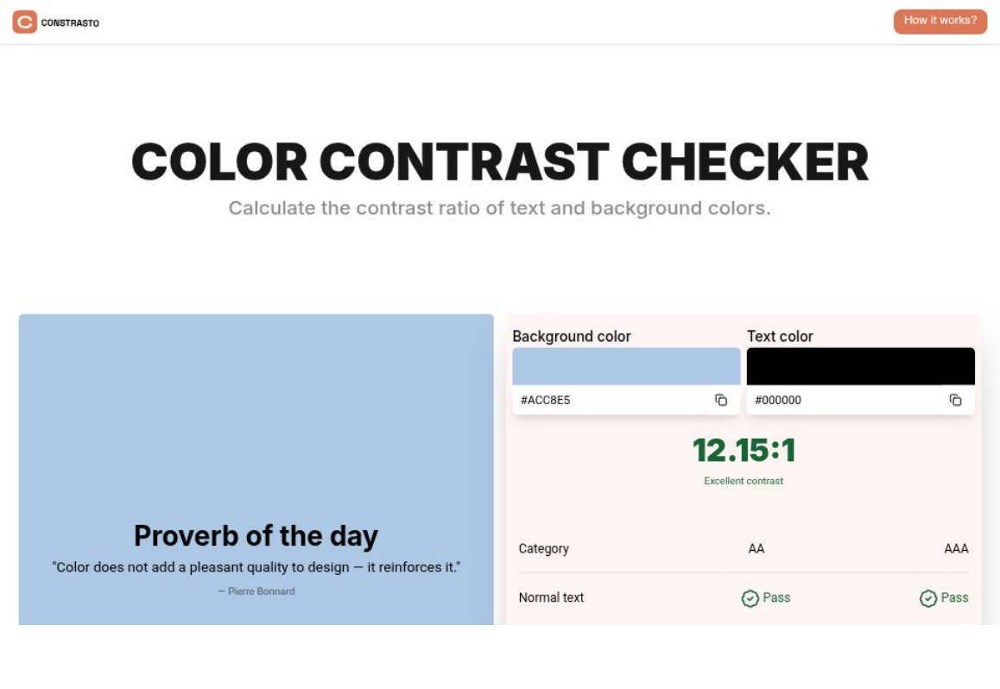

# Contrasto
> A WCAG contrast checker for devs and designers who care about accessibility.

**[Here is the link](https://codja.vercel.app)**



---

## Features

- WCAG AA & AAA contrast ratio checker
- Color blindness simulator
- Swap foreground & background instantly
- Copy as CSS, Tailwind, or shareable URL
- Save your favorite palettes locally
- Fullscreen preview mode
---

## Built with

| Tool | Usage |
|---|---|
| [Next.js](https://nextjs.org) | Framework |
| [TypeScript](https://www.typescriptlang.org) | Language |
| [Tailwind CSS](https://tailwindcss.com) | Styling |
| [next-intl](https://next-intl-docs.vercel.app) | i18n |
| [colortranslator](https://github.com/nicolo-ribaudo/colortranslator) | Color conversion |

---

## Getting started

```bash
git clone https://github.com/alpha1207vj/contrasto.git
cd contrasto
npm install
npm run dev
```

---

## License

MIT © [Codja Gedeon](https://github.com/alpha1207vj)
